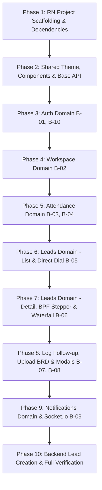

# Plan: CKR Connect BDM React Native Mobile App (`frontend-bdm`)

**Date:** 24 September 2026  
**Status:** Approved for Implementation (React Native Bare CLI + DDD Architecture)  
**Target Directory:** `frontend-bdm/`  
**Reference Docs:** `docs/PRD.md`, `docs/DESIGN.md`, `docs/SCREEN-MAP.md`, `docs/SCHEMA.md`, `docs/API.md`  
**Visual & UX Reference:** Approved Interactive Prototype (`prototype/index.html`, `prototype/app.js`, `prototype/tokens.css`, `prototype/styles.css`)  
**House Process Compliance:** `ckr-mobile-project-process` & `crash-resilience`

---

## 1. Executive Summary & Tech Stack

The BDM Mobile App is built as a **bare React Native CLI** mobile application (`frontend-bdm/`), enabling field BDMs, telecallers, and sales executives to manage their telecalling pipeline, log interactions, advance BPF stages, and punch attendance on iOS and Android devices.

### Fixed House Stack
- **Framework:** **React Native Bare CLI** (`react-native`), New Architecture (Fabric) enabled. Never Expo.
- **Language:** **Plain JavaScript (.js / .jsx)** — strictly no TypeScript (`.ts` / `.tsx`). JSDoc `@param` / `@returns` used for code documentation.
- **Navigation:** `@react-navigation/native` with `@react-navigation/native-stack` and `@react-navigation/bottom-tabs`.
- **State & Data Layer:** **Redux Toolkit (RTK)** for client UI states + **RTK Query** (`baseApi.injectEndpoints`) for all server caching, mutations, and cache invalidation. Zero mock/placeholders.
- **Design System:** Authentic **Microsoft Fluent 2 Mobile** theme tokens (Cortana Blue `#0067B8`, Neutral Canvas `#FAF9F8`, Surface `#FFFFFF`, hairline borders `#EDEBE9`), touch targets ≥ 44px, Segoe UI / System typography ramp.
- **Crash Resilience:** Loading guards on all CTA buttons (`disabled={loading}`, `<ActivityIndicator>`), user-facing `Alert.alert` error dialogs on all failures (never silent console errors), navigation locks during in-flight mutations, and a root `ErrorBoundary`.
- **Backend Connection:** Direct REST API calls to the Express backend at `/api/v1/` (`http://10.0.2.2:4003` for Android emulator, `http://localhost:4003` for iOS simulator, configurable via environment/config).

---

## 2. Scalable Domain-Driven Design (DDD) Folder Structure

The codebase is partitioned strictly by business domains. A domain only imports from itself and `src/shared/` — domains never cross-import from other domains directly.

```
frontend-bdm/
├── package.json
├── App.jsx                       # Root component with Provider, SafeAreaProvider, ErrorBoundary
├── index.js                      # React Native app entry registration
├── babel.config.js
├── metro.config.js
├── app.json
└── src/
    ├── shared/                   # Cross-domain primitives & foundational infrastructure
    │   ├── theme/
    │   │   ├── colors.js         # Fluent 2 color tokens (Cortana blue, canvas, surface, status)
    │   │   ├── typography.js     # Text sizes (Display, Title, Subtitle, Body, Caption) & weights
    │   │   ├── spacing.js        # Spacing scale (4, 8, 12, 16, 20, 24, 32, 40)
    │   │   ├── radius.js         # Border radius tokens (xs: 2, sm: 4, md: 8, lg: 12, pill: 9999)
    │   │   ├── shadows.js        # Elevation and platform shadow styles
    │   │   └── index.js
    │   ├── components/           # Reusable UI primitives
    │   │   ├── ErrorBoundary.jsx # Global crash catcher
    │   │   ├── FluentButton.jsx  # Primary, secondary, danger, success with loading spinner & disabled guard
    │   │   ├── FluentInput.jsx   # 44px mobile input with focus outline & error message
    │   │   ├── FluentCard.jsx    # Surface card container with 1px hairline border & subtle shadow
    │   │   ├── StatusBadge.jsx   # Pill status badge with paired background (Won, Contacted, etc.)
    │   │   ├── ProcessFlowBar.jsx # Business Process Flow (BPF) chevron stepper (5 stages)
    │   │   ├── FilterChip.jsx    # Horizontal scrollable filter chip
    │   │   ├── WaterfallNode.jsx # Timeline node with channel icon, timestamp, and quotation
    │   │   ├── BottomSheet.jsx   # Reusable modal / bottom sheet container
    │   │   ├── MetricTile.jsx    # Big-number KPI tile for dashboard & performance metrics
    │   │   └── EmptyState.jsx    # Zero-state placeholder with icon, message, and CTA
    │   ├── navigation/
    │   │   ├── RootNavigator.jsx # Auth Stack vs Main Bottom Tab Navigator
    │   │   ├── BottomTabNavigator.jsx # 4-tab thumb navigation (Dashboard, My Leads, Attendance, Alerts)
    │   │   └── routes.js         # Centralized route name constants
    │   ├── store/
    │   │   ├── index.js          # configureStore assembling baseApi and domain slices
    │   │   ├── baseApi.js        # Base RTK Query slice with JWT Bearer header injection
    │   │   └── uiSlice.js        # Global UI states (modal visibilities, active filters)
    │   └── utils/
    │       ├── formatters.js     # ₹ Indian currency formatting, dates (DD MMM YYYY), times
    │       ├── communication.js  # Linking helpers for tel:, wa.me, and mailto:
    │       └── storage.js        # Async storage abstraction for JWT tokens & onboarding flag
    └── domains/                  # Feature business domains
        ├── auth/
        │   ├── screens/
        │   │   ├── LoginScreen.jsx               # B-01: BDM login with employee ID/email & password
        │   │   └── WelcomeWalkthroughScreen.jsx  # B-10: 3-slide new hire onboarding carousel
        │   ├── components/
        │   │   └── AuthHeader.jsx                # Branded CKR Connect lock logo & tagline
        │   ├── slice.js                          # Auth state (user, token, isAuthenticated)
        │   └── api.js                            # RTK Query endpoints for /auth/login, /bootstrap
        ├── workspace/
        │   ├── screens/
        │   │   └── WorkspaceScreen.jsx           # B-02: BDM Workspace with 3 segmented sub-tabs
        │   ├── components/
        │   │   ├── PunchStatusCard.jsx           # Active check-in pulse, check-in time, punch out action
        │   │   ├── UntouchedAlertBanner.jsx      # High-urgency amber banner for untouched leads
        │   │   ├── PipelineMatrixGrid.jsx        # 2-column cards (Untouched, Follow-up, Won, etc.)
        │   │   ├── CallingTargetCard.jsx         # Daily target meter (X/15 calls) + outcome breakdown
        │   │   ├── CallLedgerFeed.jsx            # Chronological today's call ledger with outcome pills
        │   │   ├── FunnelTab.jsx                 # Stage-by-stage pipeline breakdown
        │   │   └── PerformanceTab.jsx            # Self-scoped KPIs & weekly deal progress chart
        │   └── api.js                            # RTK Query endpoints for /bdm/workspace/dashboard
        ├── attendance/
        │   ├── screens/
        │   │   ├── AttendancePunchScreen.jsx     # B-03: Punch In / Punch Out hero toggle with live timer
        │   │   └── AttendanceHistoryScreen.jsx   # B-04: Monthly summary & chronological daily punch logs
        │   ├── components/
        │   │   ├── PunchHeroButton.jsx           # Animated circular punch button with pulsing border
        │   │   └── AttendanceHistoryItem.jsx     # Card showing date, in/out timestamps, and status pill
        │   ├── slice.js                          # Attendance local timers & cached punch status
        │   └── api.js                            # Endpoints: /bdm/attendance/today, punch-in, punch-out, my-history
        ├── leads/
        │   ├── screens/
        │   │   ├── MyLeadsScreen.jsx             # B-05: My Assigned Leads with search, chips & quick dial
        │   │   ├── LeadDetailScreen.jsx          # B-06: Detail view with BPF stepper & waterfall timeline
        │   │   ├── LogFollowupScreen.jsx         # B-07: Log activity (Channel, Outcome, Notes, Next date)
        │   │   └── UploadBrdScreen.jsx           # B-08: Document picker & VPS upload
        │   ├── components/
        │   │   ├── LeadCardItem.jsx              # Lead card with untouched tag, ₹ value, direct Call/WA
        │   │   ├── LeadSpecsTable.jsx            # 12-row key-value specifications table
        │   │   ├── QuickAddLeadModal.jsx         # Quick add inbound lead bottom sheet
        │   │   ├── CloseDealWonModal.jsx         # Won modal (Closed amount ₹, deal type, account)
        │   │   └── DropoffLostModal.jsx          # Drop-off modal (Lost vs Invalid with mandatory reason)
        │   ├── slice.js                          # Active filters (urgency, stage, search query)
        │   └── api.js                            # Endpoints: /bdm/leads (GET, POST), /status, /upload-brd
        └── notifications/
            ├── screens/
            │   └── NotificationsScreen.jsx       # B-09: Live alerts feed with read/unread status
            ├── components/
            │   └── NotificationCardItem.jsx      # Alert card with category border, timestamp, mark-read
            ├── socket.js                         # Socket.io client setup listening for 'notification'
            └── api.js                            # Endpoints: /bdm/notifications, mark-read, mark-all-read
```

---

## 3. Screen & Functional Mapping (B-01 through B-10 + Overlays)

| Screen ID | Title | Purpose & Visual Elements | Backend Endpoint |
|---|---|---|---|
| **B-01** | BDM Login | Branded header, Employee ID/email & password inputs, 44px primary action button with loading spinner, network error alert | `POST /auth/login` |
| **B-02** | Workspace & Dashboard | 3 Sub-tabs (**Today's Activity**, **Pipeline Funnel**, **My Performance**). Contains Punch Status card, Quick Actions ("+ Add Lead", "My Pipeline"), Untouched Leads Alert Banner, 2-Column Pipeline Matrix Grid, Daily Target meter, Today's Call Ledger feed | `GET /bdm/workspace/dashboard`, `GET /bootstrap` |
| **B-03** | Attendance Punch | Punch In / Punch Out hero toggle with live timer, active status, today's check-in/out timestamps | `GET /bdm/attendance/today`, `POST /bdm/attendance/punch-in`, `POST /bdm/attendance/punch-out` |
| **B-04** | Attendance History | Monthly summary card (Present, Half-day, Absent, Holidays), chronological list of daily punches with color-coded status badges | `GET /bdm/attendance/my-history?year=...&month=...` |
| **B-05** | My Assigned Leads | Real-time text search, horizontal scrolling Urgency filter chips (`All`, `🚨 Overdue`, `⏰ Due Today`, `🏆 Won`), Stage filter chips (`⚡ Untouched`, `Follow-up`, `Proposal`, `Contacted`, `Won`), lead cards with direct `tel:` (Call) and `wa.me` (WhatsApp) buttons | `GET /bdm/leads?search=...&status=...&tag_id=...` |
| **B-06** | Lead Detail & Stepper | Header back button, entity card (forecast, priority, win %), BPF Chevron Stepper, Won CTA, full specs key-value table, attached BRD status, Interaction Waterfall timeline feed | `GET /bdm/leads/:id` |
| **B-07** | Log Follow-up / Interaction | Channel picker (Phone, WhatsApp, Video Demo, Site Visit, Note), Call Result outcome picker, Discussion notes textarea, next action date picker | `POST /bdm/interactions` |
| **B-08** | Upload BRD Document | Document picker (PDF/DOCX), VPS disk storage upload with progress | `POST /bdm/leads/:id/upload-brd` |
| **B-09** | Notifications Feed | In-app alerts delivered via Socket.io (lead assignments, overdue follow-ups), unread indicators, mark-as-read CTA | `GET /bdm/notifications`, `PATCH /bdm/notifications/:id/read`, `POST /bdm/notifications/mark-all-read` |
| **B-10** | Welcome Walkthrough | 3-slide onboarding carousel for new BDM hires introducing Leads, Attendance Punch, and Alerts | Local state / `PATCH /users/me/onboarding` |
| **Overlay** | Quick Add Inbound Lead | Slide-up modal: Name, Phone, Notes (Required), Company, Solution Tag, Budget, Date, City, State, Email (Optional) | `POST /bdm/leads` |
| **Overlay** | Close Deal as Won | Deal modal: Closed amount (₹), Deal type, Customer Account name, Closing notes | `PATCH /bdm/leads/:id/status` (`status: 'won'`) |
| **Overlay** | Drop-off / Lost Modal | Reason modal: Lost vs Invalid with mandatory reason dropdowns | `PATCH /bdm/leads/:id/status` (`status: 'lost'/'invalid'`) |

---

## 4. Development Phases



### Phase 1: Bare React Native Project Scaffolding
- Initialize `frontend-bdm/` with bare React Native CLI configuration.
- Setup dependencies in `package.json`:
  - `react`, `react-native`
  - `@reduxjs/toolkit`, `react-redux`
  - `@react-navigation/native`, `@react-navigation/native-stack`, `@react-navigation/bottom-tabs`
  - `react-native-safe-area-context`, `react-native-screens`
  - `socket.io-client`
- Configure `metro.config.js`, `babel.config.js`, and `app.json`.

### Phase 2: Shared Foundations, Tokens & Base API
- Create `src/shared/theme/`:
  - `colors.js` (Fluent 2 palette: `#0067B8`, `#FAF9F8`, `#FFFFFF`, `#107C10`, `#D97706`, `#A4262C`, `#EDEBE9`)
  - `typography.js` (Display: 28, Title: 20, Subtitle: 16, Body: 14, Caption: 12, Overline: 10)
  - `spacing.js` (4 to 40), `radius.js` (2 to 9999), `shadows.js` (Fluent elevations)
- Create `src/shared/components/`:
  - `ErrorBoundary.jsx` (Global crash handler with restart CTA)
  - `FluentButton.jsx` (Primary, secondary, outline with `disabled={loading}` and `<ActivityIndicator>`)
  - `FluentInput.jsx` (44px touch height, label, error helper)
  - `FluentCard.jsx` (Surface card with hairline border)
  - `StatusBadge.jsx` (Color-coded status pill)
  - `ProcessFlowBar.jsx` (5-stage Business Process Flow chevron bar)
  - `FilterChip.jsx` (Horizontal scrollable chip button)
  - `WaterfallNode.jsx` (Timeline node with channel icon, timestamp, and quotation)
  - `BottomSheet.jsx` (Slide-up modal container)
  - `MetricTile.jsx` (Big-number KPI tile)
  - `EmptyState.jsx` (Zero-state graphic and text)
- Create `src/shared/store/`:
  - `baseApi.js` (RTK Query `createApi` with JWT header injection, tagging: `['Dashboard', 'Leads', 'Lead', 'Interactions', 'Attendance', 'Notifications', 'Bootstrap']`)
  - `index.js` (Redux store configuration assembling API and domain slices)
- Create `src/shared/utils/`:
  - `formatters.js` (₹ Indian currency formatter, dates, times)
  - `communication.js` (Deep linking for `Linking.openURL('tel:...')` and `Linking.openURL('https://wa.me/...')`)
  - `storage.js` (AsyncStorage wrapper for JWT token & onboarding flags)
- Create `src/shared/navigation/`:
  - `routes.js` (Route name constants)
  - `RootNavigator.jsx` & `BottomTabNavigator.jsx` (4-tab thumb navigation with badge counters)

### Phase 3: Auth Domain (`B-01` & `B-10`)
- `src/domains/auth/api.js`: Endpoints for `loginMutation` (`/auth/login`) and `bootstrapQuery` (`/bootstrap`).
- `src/domains/auth/slice.js`: Session token, user profile, isAuthenticated flag.
- `src/domains/auth/screens/LoginScreen.jsx` (`B-01`): CKR Connect header, employee ID/email & password inputs, loading CTA, error Alert dialog.
- `src/domains/auth/screens/WelcomeWalkthroughScreen.jsx` (`B-10`): 3-slide onboarding carousel for new BDM hires.

### Phase 4: Workspace Domain (`B-02`)
- `src/domains/workspace/api.js`: Endpoint for `getBdmDashboard` (`/bdm/workspace/dashboard`).
- `src/domains/workspace/screens/WorkspaceScreen.jsx` (`B-02`): 3-tab segmented selector (Today's Activity, Pipeline Funnel, My Performance).
- Components:
  - `PunchStatusCard.jsx`: Check-in timestamp, active green pulse, Punch Out button.
  - `UntouchedAlertBanner.jsx`: Amber warning card highlighting leads assigned with 0 calls, with direct "Call Now ›" CTA.
  - `PipelineMatrixGrid.jsx`: 2-column cards (Untouched, Follow-up, Contacted, Proposal, Deals Won, Total Assigned).
  - `CallingTargetCard.jsx`: Daily target meter (X/15 calls logged) + call result pills.
  - `CallLedgerFeed.jsx`: Chronological call ledger feed with channel icons, outcome pills, and discussion quotes.
  - `FunnelTab.jsx`: Pipeline stages and overdue counts.
  - `PerformanceTab.jsx`: Self-scoped KPI tiles (Revenue Won, Weighted Pipeline, Avg Deal Size, Conversion Rate) + Weekly Deal Progress bar chart.

### Phase 5: Attendance Domain (`B-03` & `B-04`)
- `src/domains/attendance/api.js`: Endpoints for `/bdm/attendance/today`, `punch-in`, `punch-out`, `my-history`.
- `src/domains/attendance/slice.js`: Active timer and punch cache.
- `src/domains/attendance/screens/AttendancePunchScreen.jsx` (`B-03`): Hero card with today's date, large thumb-friendly circular punch button with pulsing animation, check-in time.
- `src/domains/attendance/screens/AttendanceHistoryScreen.jsx` (`B-04`): Monthly summary (Days present, half-day, absent, holidays) and daily punch log items with color-coded status badges.

### Phase 6: Leads Domain — My Assigned Leads (`B-05`)
- `src/domains/leads/api.js`: Endpoints for `/bdm/leads` (list, detail, create, status, upload-brd).
- `src/domains/leads/slice.js`: Active filters (urgency, stage, search query).
- `src/domains/leads/screens/MyLeadsScreen.jsx` (`B-05`):
  - Live search input with clear button.
  - Horizontal scrolling Urgency Chips (`All`, `🚨 Overdue`, `⏰ Due Today`, `🏆 Won`).
  - Horizontal scrolling Stage Chips (`⚡ Untouched`, `Follow-up`, `Proposal`, `Contacted`, `Won`).
  - Lead cards with untouched tag, contact name, school/company, city/state, ₹ value, priority pill, and direct "📞 Call" and "💬 WA" buttons.
  - Empty search state.

### Phase 7: Leads Domain — Detail, BPF Stepper & Waterfall (`B-06`)
- `src/domains/leads/screens/LeadDetailScreen.jsx` (`B-06`):
  - Header back button and status badge.
  - Key entity header card (contact name, company, forecast value, priority, win %, direct Call/WA/Email touch targets).
  - Business Process Flow (BPF) Chevron Stepper with interactive stage advance.
  - Primary Action buttons: "🏆 Close Deal as Won", "+ Log Activity", "📎 Scope BRD".
  - Full Lead Specifications table (Phone, Email, Location, Institution, Solution Tag, Budget, Expected Value, Next Action Due, Touchpoints, Assigned BDM, Source, Created Date).
  - Attached BRD document card with download/view.
  - Interaction Waterfall History: connected vertical timeline with channel icons, call outcome pills, discussion notes quote, next action reminder, and genesis inbound lead node.

### Phase 8: Log Follow-up, Upload BRD & Shared Overlays (`B-07`, `B-08`, Modals)
- `src/domains/leads/screens/LogFollowupScreen.jsx` (`B-07`): Channel picker, Call Result outcome picker, Discussion notes textarea, Next action scheduled date picker.
- `src/domains/leads/screens/UploadBrdScreen.jsx` (`B-08`): Document picker, VPS storage notes, multipart upload to `/bdm/leads/:id/upload-brd`.
- Modals:
  - `QuickAddLeadModal.jsx`: Required fields (Name, Phone, Notes) and optional fields (Company, Tag, Expected Value, Date, City, State, Email).
  - `CloseDealWonModal.jsx`: Closed amount (₹), Deal type, Customer Account name, Closing notes.
  - `DropoffLostModal.jsx`: Lost vs Invalid selection with mandatory reason dropdown.

### Phase 9: Notifications Domain & Real-Time Sync (`B-09`)
- `src/domains/notifications/api.js`: Endpoints for `/bdm/notifications`, `mark-read`, `mark-all-read`.
- `src/domains/notifications/socket.js`: Socket.io listener for `notification` events, updating RTK Query cache and unread badges.
- `src/domains/notifications/screens/NotificationsScreen.jsx` (`B-09`): Color-coded alerts with category indicators and mark-as-read action.

### Phase 10: Backend Lead Creation & Full Verification
- Add `POST /api/v1/bdm/leads` in `backend/src/domains/bdm/leads/` to allow BDMs to create inbound leads assigned to themselves with their initial note.
- Verify end-to-end flow with real BDM account (`aarav.sharma@ckrtechnologies.in`):
  - Login → Check punch status → Punch In → Inspect Workspace Matrix → Tap Untouched lead → Advance BPF chevron → Log Phone Call with outcome → Verify waterfall update → Punch Out.
  - Check cross-app reflection in Admin Panel (`frontend-admin2`): Attendance Matrix reflects punch, Leads Grid reflects new stage and interaction.

---

## 5. Verification Plan

### Automated Checks
- Dependency resolution check: Verify `node -e "require('./package.json')"` and all module imports resolve.
- Domain isolation audit: Ensure no domain imports from any other domain's internals (only from its own folder and `src/shared/`).
- Metro bundle check: Test bundling with React Native Metro CLI.

### Manual Test Flows
1. **Auth & Session:** Login with BDM credentials; check token storage and redirection.
2. **Attendance Punch:** Click Punch In; check active pulse; click Punch Out; check monthly record reflected in `B-04` and in Admin Attendance Matrix (`A-11`).
3. **Dashboard Metrics:** Verify calling target progress meter increments upon logging a call.
4. **Lead Search & Filters:** Search for a contact name; toggle "🚨 Overdue" and "⚡ Untouched" chips.
5. **Waterfall Timeline:** Log a new phone call with "Interested / Follow-up Callback Set" outcome; verify the new node prepends to the waterfall.
6. **Deal Won:** Click "Close Deal as Won", enter closed amount, verify stage updates to Won and revenue updates.
7. **Communication Links:** Confirm phone dialer (`tel:`) and WhatsApp deep links trigger properly via `Linking.openURL`.
